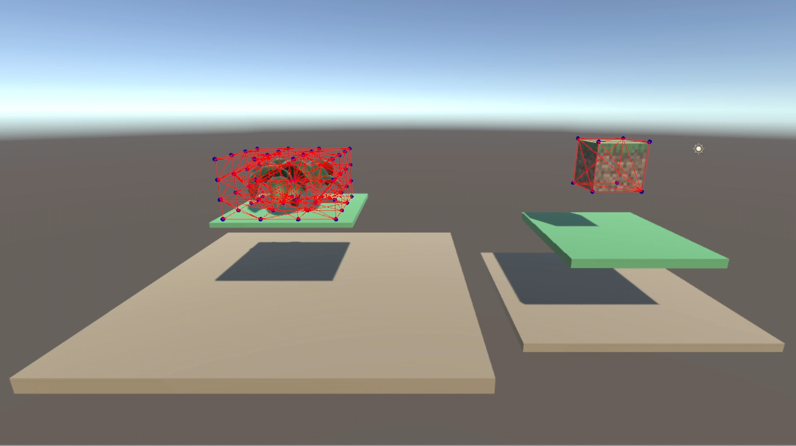
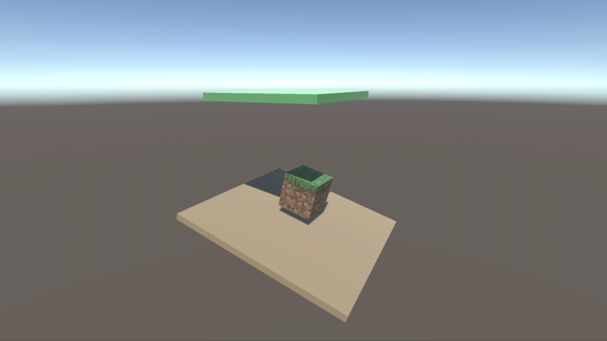
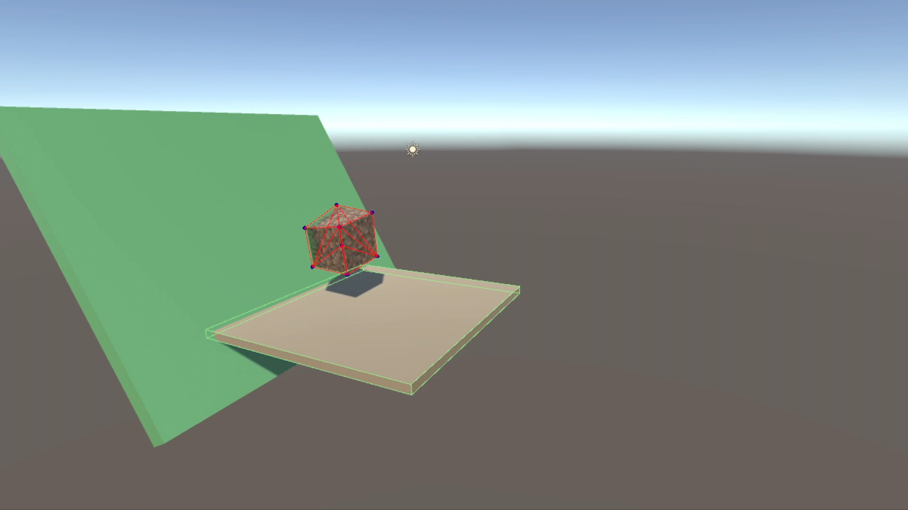
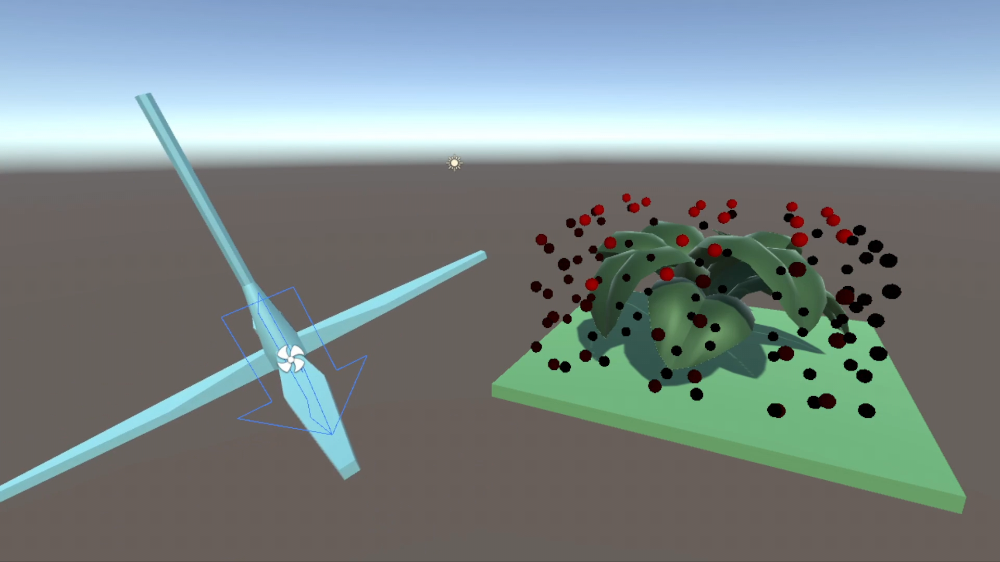

<h1 align="center">Custom Solid Physics [Unity 2020.3.21f1]</h1>

Video here: https://www.youtube.com/watch?v=55g2WV_Q0_g

<h2>Controls</h2>
<ul>
  <li>[MNBVC] to display different gizmos.</li>
  <li>[&#10005;] fixer detection ON/OFF.</li>
  <li>[Z] applies an impulse to the mesh.</li>
  <li>[R] to reset bodies.</li>
</ul>

 

  
  
  
  

